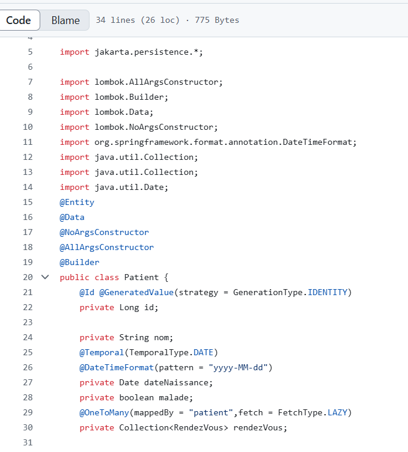
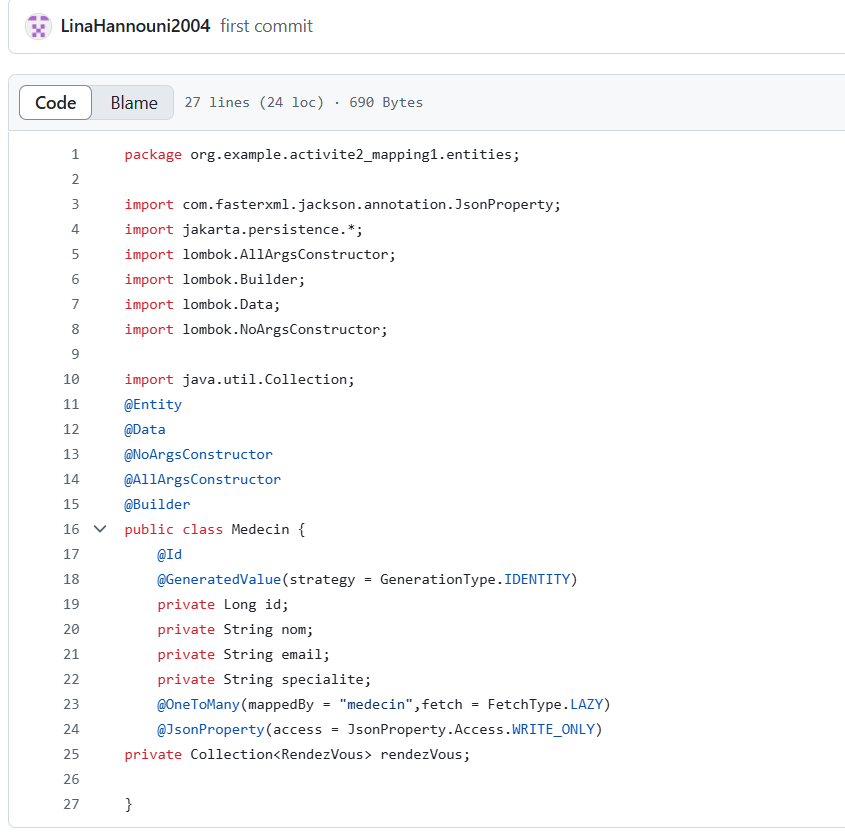
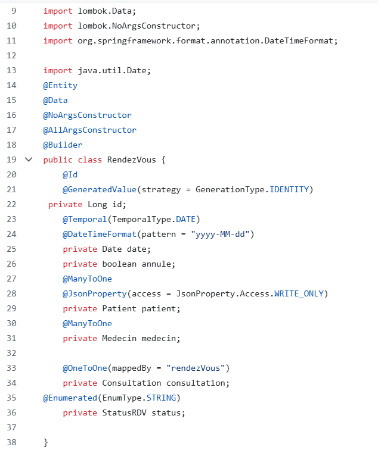
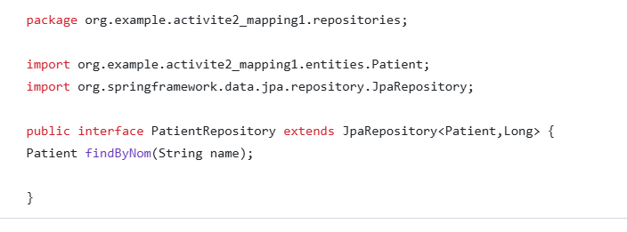
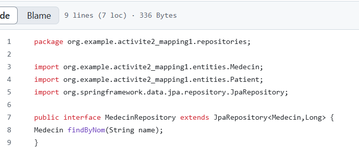
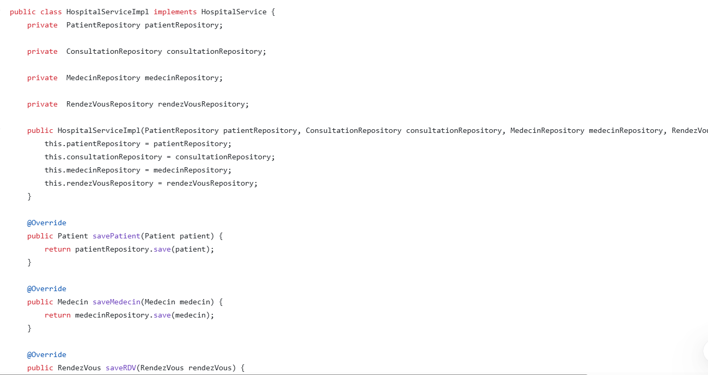
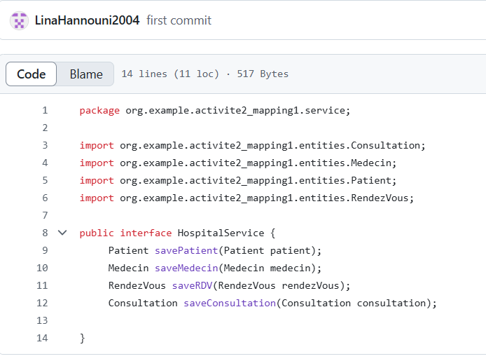
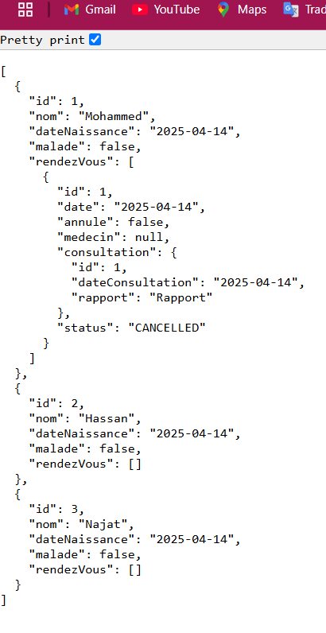

<h1> l'activité Pratique N°2 Partie 2:Mappine OneToOne/OneToMany</h1>

Dans cette partie on va parler des associations des classes. La première chose à présenter c'est nos entités 

<h3>Les Entités</h3>
<h4>Patient:</h4>

<h4>Medecin:</h4>

<h4>RendezVous:</h4>

<h3>On va parler du package repositories</h3>
<h4>Patient:</h4>

<h4>Medecin:</h4>

<h3>on va parler des services de l'interface et son implementation</h3>

<h4>son implementation:</h4>

<h3>voici l'interface</h3>

